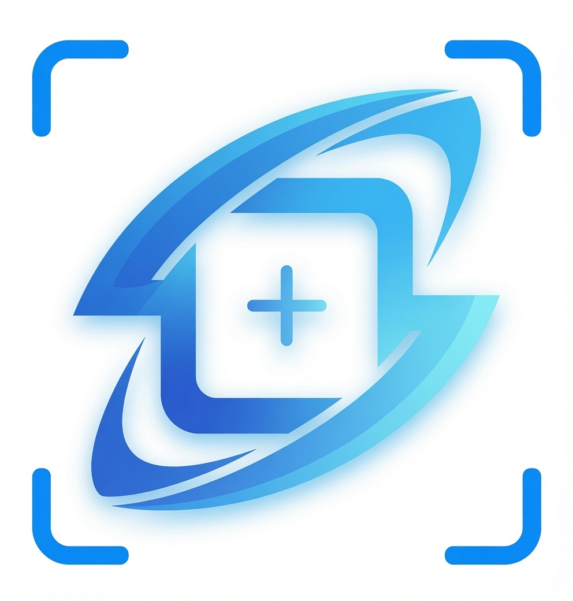

<p align="center">
  
</p>

<h1 align="center">Screenshot Plus</h1>

<p align="center">
  Screenshot tool for Windows. Capture, annotate, hide information, stitch long pages by scrolling,
  and present with live zoom and a laser pointer. A single portable executable, free and open source.
</p>

<p align="center">
  <a href="README.md">Español</a> · <a href="README.en.md">English</a>
</p>

<p align="center">
  <a href="https://github.com/Cris223511/screenshot-plus/releases/latest"></a>
  <a href="https://github.com/Cris223511/screenshot-plus/releases"></a>
  
  
  <a href="LICENSE"></a>
</p>

---

## Why

Taking a screenshot, marking it with an arrow and sending it should not require three programs or a subscription. The tools that do this well are usually paid, add a watermark or come loaded with ads. The free ones fall short when it comes to annotating, capturing a full scrolling page or presenting live. Screenshot Plus brings that whole workflow together into a single portable executable, with no installation, no account and no paid features.

## Downloads

| Version | File | Status |
| ------- | ---- | ------ |
| 1.2.3 | [ScreenshotPlus.exe](https://github.com/Cris223511/screenshot-plus/releases/download/v1.2.3/ScreenshotPlus.exe) | Available |

Just download the `.exe` and run it. There is no installer and no extra steps. Every version is in the [releases](https://github.com/Cris223511/screenshot-plus/releases) section, and what changed in each one is detailed in the [changelog](CHANGELOG.md).

> **About the Windows SmartScreen warning.** The first time you run the file, Windows may show "Windows protected your PC" and report an unknown publisher. This is the normal behavior for any program whose author has not paid for a code signing certificate, a paid service that lets Windows recognize the developer. It does not mean the file has a problem, and its full source code is available in this repository for anyone who wants to review it. To open it, click **More info** and then **Run anyway**. The warning stops appearing over time, as more people download and run the same file.

## Features

### Capture

- **Region (Alt + A):** the screen freezes and you drag the cursor to draw a rectangle over the area you want to capture. On release, the annotation editor opens. Before you continue, that rectangle can be moved and resized to fine-tune the selection.
- **Full screen (Alt + S) and active window (Alt + W):** both open the same editor with the area already selected, the whole screen in one case and the window you had in the foreground in the other. You annotate if you need to, then choose to copy or save.
- **Scrolling capture (Alt + D):** made for content that does not fit on screen, such as a web page or a long document. You pick the area, the rest of the screen is covered by a dark layer, and as you scroll the content with the mouse wheel the app joins each visible portion into a single long image, with a preview that updates in real time. The stitching tolerates the usual visual noise, such as font smoothing or a blinking cursor, and discards repeated portions so nothing is duplicated. When you finish, the image opens in a scrollable editor.
- **Native resolution:** every capture is taken at the monitor's native resolution, lossless, even when Windows applies 125 or 150 % scaling.
- **Panel kept out of the image:** the application's own window is excluded from capture at the operating system level. Even if the panel is visible on screen when you capture, it does not appear in the resulting image, so there is no need to move it aside or close it first.

### Annotation editor

- **Eight shapes:** rectangle, rounded rectangle, ellipse, triangle, diamond, pentagon, hexagon and star.
- **Lines and arrows:** with the cap on each end configurable independently (no cap, arrow, filled arrow, dot, square or diamond) and five stroke styles (solid, dashed, dotted, dash-dot and dash-dot-dot).
- **Brush:** free drawing with adjustable thickness. Hold Shift and the stroke comes out straight.
- **Text:** with every font installed on the system, plus size, bold, italic, underline, strikethrough, letter spacing, rotation, background color (solid or with rounded corners), shadow and outline. One click selects the text and a double click opens it again to edit its content.
- **Hide tool:** covers any part of the image. You paint over the area and, on release, that area becomes pixelated or blurred, with the intensity and thickness you choose.
- **Opacity and images:** opacity adjustable on any element, plus images pasted from the clipboard with Ctrl + V.
- **Eraser:** removes the annotations it touches, with configurable thickness.
- **Multi-selection:** Shift and a click add or remove elements one by one, and you can also enclose several by drawing a selection rectangle with the mouse. The selected elements are edited or deleted together, and the toolbar shows only the options they have in common.
- **Later editing:** any element already drawn can be selected again to move it, resize it from its handles, or change its color, thickness and style from the same toolbar, with the change reflected instantly. Right after you draw an element it stays selected, ready to reposition.
- **Design-editor modifiers:** Shift straightens lines in 15 degree steps, keeps the proportions of shapes and elements when resizing, and constrains movement to horizontal or vertical. Alt grows the shape from its center. Alt together with a drag duplicates the element.
- **Single-letter shortcuts:** switch tools without going to the toolbar (V select, S shapes, L line, F arrow, B brush, T text, P hide, E eraser).
- **Undo, redo and editing:** undo (Ctrl + Z, which includes moves), redo (Ctrl + Y), delete the selected element (Del), reset all, copy (Ctrl + C) and save (Ctrl + S).

### Presentation whiteboard

Built for classes and meetings. It is a side panel that stays floating over the other windows. When you activate a tool, it freezes the screen image and turns it into a whiteboard you can draw on. When you leave, the screen returns to normal, with no marks left behind.

- **Side panel:** shows the shortcut letter of each tool (letters you can reassign). It can be dragged to any edge of the screen and shrinks to a small floating button when you are not using it.
- **Tools:** zoom with the mouse wheel (Z), selection and handle editing (V), a hand to pan the view (H), eraser (E), brush (P), line (I), arrow (F), shapes (T for text and S for the geometric shapes; each press of S moves to the next of the eight available shapes), highlighter (R) and a laser pointer with a configurable trail length (L).
- **Properties panel:** next to the toolbar, with recently used colors and a field for the hex code, thickness, stroke styles, arrow caps, opacity and all the text options. If something is selected, the panel loads its values and changes apply live, even across several elements at once.
- **Images:** inserted from a file or pasted with Ctrl + V, which you then move and resize.
- **Shortcuts with the panel collapsed:** even when the panel is a floating button, each tool still responds to Alt plus its letter from any window.
- **Undo and redo:** by action, with the option to bring back what was erased or cleared at once.
- **Built-in capture:** Ctrl + C copies the whole board with the drawings, Ctrl + S saves it, and Ctrl + A crops and saves only the part you select.

### Application

- **Global hotkeys:** active at all times, even over fullscreen games and browsers, and all customizable. Only the presentation whiteboard turns itself off for a fullscreen game or app; over a fullscreen browser it stays available.
- **Nine languages:** Spanish (default), English, Portuguese, French, German, Italian, Japanese, Chinese and Russian. The change applies instantly, with no restart.
- **Fourteen save formats:** PNG, JPG, JPEG, JFIF, WEBP, GIF, AVIF, BMP, TIFF, TIF, HEIC, HEIF, ICO and TGA, with adjustable quality on the ones that support it and the option to open the folder after saving.
- **Appearance:** light and dark themes, a button to keep the panel above every other window, and notifications and tooltips with their own animation.
- **Single instance:** running the `.exe` a second time does not open another copy, it brings the running one to the front.
- **Start with Windows:** opens the app minimized to the system tray. There is also a start-straight-in-the-tray option. Both are optional.
- **Reset settings:** from Options, without deleting any screenshot or changing the save folder.
- **Update check:** against this repository's releases, with no servers of its own and no data collection.
- **Built-in user manual and info window:** no link takes you outside the application, except the one that opens the repository.
- **Remembered folder:** the save folder is kept between sessions. The last one you use is the one offered next time.

## Default hotkeys

| Action | Hotkey |
| ------ | ------ |
| Capture region | Alt + A |
| Capture full screen | Alt + S |
| Capture current window | Alt + W |
| Scrolling capture | Alt + D |
| Presentation panel | Alt + Z |
| Show or hide the panel | Alt + Q |
| Copy / save in the editor | Ctrl + C / Ctrl + S |
| Undo / delete element | Ctrl + Z / Del |

Every global hotkey can be changed in Options → Hotkeys by pressing the new combination.

## Usage

1. Open `ScreenshotPlus.exe`. The panel appears and the app stays active in the system tray.
2. Press Alt + A, drag over the area, and annotate whatever you need with the toolbar.
3. Use Ctrl + C to copy or Ctrl + S to save. A notification confirms the action. Esc cancels at any moment.

## Running from source

You only need Python 3.10 or later on Windows.

```
git clone https://github.com/Cris223511/screenshot-plus.git
cd screenshot-plus
pip install -r requirements.txt
python main.py
```

## Building the executable

```
scripts\build.bat
```

The script installs PyInstaller if needed, converts the logo to the Windows icon format and leaves `ScreenshotPlus.exe` in the `dist` folder.

## Technology

| Component | Library | What it is used for |
| --------- | ------- | ------------------- |
| Interface | [PySide6](https://doc.qt.io/qtforpython-6/) (Qt) | Windows, overlays, animations, themes and tray |
| Capture | [mss](https://github.com/BoboTiG/python-mss) | Screen reads at native resolution, multi-monitor |
| Imaging | [Pillow](https://python-pillow.org/) | Long-capture stitching, export and icon creation |
| Global hotkeys | [pynput](https://github.com/moses-palmer/pynput) | Keys that respond with the app in the background |
| Windows integration | [pywin32](https://github.com/mhammond/pywin32) and ctypes | Active window, registry and capture exclusion |
| Packaging | [PyInstaller](https://pyinstaller.org/) | The single portable executable |

One technical detail worth mentioning. Live zoom is possible because the app's windows are excluded from system capture with `WDA_EXCLUDEFROMCAPTURE`. Thanks to that, the app can photograph the screen about 25 times per second without capturing itself in the process.

## Project structure

```
screenshot-plus/
├── main.py                     entry point and single instance control
├── assets/
│   ├── icons/                  the interface's own SVG icons
│   └── logo/                   application logo
├── docs/manual.md              user manual (shown inside the app)
├── scripts/build.bat           executable build script
└── src/
    ├── config/                 preferences, safe paths and hotkeys
    ├── core/                   capture, scroll stitching, clipboard and saving
    ├── i18n/                   translator and the 9 languages as json
    ├── ui/
    │   ├── overlays/           selection editor, presentation mode and floating panel
    │   ├── dialogs/            options, info, manual and language
    │   ├── widgets/            animated buttons, palette and icons
    │   └── themes/             light and dark themes (qss)
    └── utils/                  global hotkeys, single instance, autostart and updates
```

## Settings and data

- **Preferences:** stored in `%APPDATA%\ScreenshotPlus\settings.json`.
- **Screenshots:** go by default to a `Screenshot Plus` subfolder inside your real Pictures folder, which is asked to Windows and works in any system language.
- **Privacy:** the application collects no data and never connects to the internet, except when you ask it to check for updates, at which point it makes a single request to GitHub's public API.

## Contributing

Bug reports and ideas are welcome in the [issues](https://github.com/Cris223511/screenshot-plus/issues). To contribute code, open a pull request. The project runs with `python main.py` and no extra setup.

## License

MIT © [Cris223511](https://github.com/Cris223511). You can use it, modify it and share it freely. The full text is in the [LICENSE](LICENSE) file.

If the application is useful to you, a star on the repository helps more people find it.
